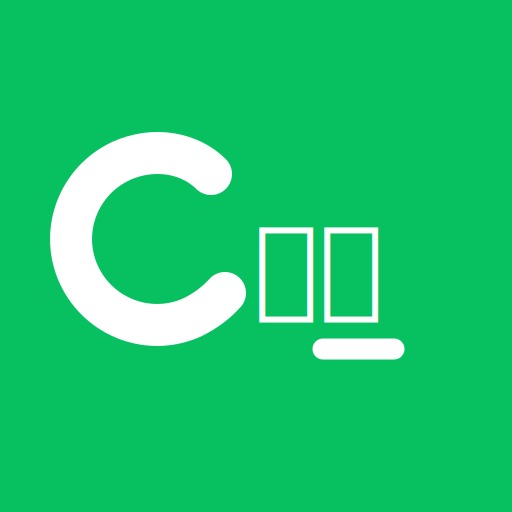
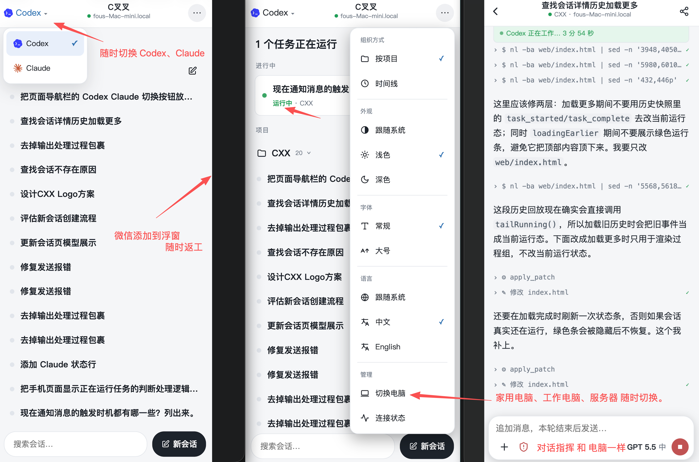

<div align="center">



# CXX

### CXX is an enhancement tool that adds phone and WeChat remote takeover to your local Codex / Claude Code.

<p><strong>View sessions, approve commands, start new turns, and take over  Codex and  Claude Code from any phone browser.</strong></p>

<p>
  
  
  
  
</p>

[简体中文](./README.md)　·　**English**　·　[Protocol](./public/PROTOCOL.md)　·　[Security](./public/SECURITY.md)

<br />



<sub>Scan a QR and go · Codex / Claude Code session lists, session view, chat, and new turns · pin it for one-tap return from any chat</sub>

</div>

---

A Codex or Claude Code run takes ten minutes to an hour, and it keeps you chained to your desk. **CXX brings both to your phone**: step away and still watch them work, approve commands, send new instructions — and the moment a task finishes, it pings you.

It talks to your existing, unmodified local CLIs — `codex` for Codex and, when installed, `claude` for Claude Code. CXX spawns `codex app-server` for Codex, registers Claude Code as an optional second agent, and bridges both to your phone over an end-to-end-encrypted, zero-knowledge relay.

> [!TIP]
> **Not tied to any one app**: any phone browser works, and notifications go to WhatsApp / Telegram / Slack (via webhook), Bark on iOS, or — in China — WeChat. Pick whatever's handy.

## ✨ Why from your phone

<table>
<tr>
<td width="33%" valign="top">

### 🔔 It pings you
When a task finishes or needs approval, configured channels push a notification to your phone.

</td>
<td width="33%" valign="top">

### 📱 Tap to take over
Open the deep link from a notification in your phone's browser (including a messenger's in-app browser): read the conversation, approve commands, send new instructions, switch models — all from your phone. No app, no SSH.

</td>
<td width="33%" valign="top">

### 🔒 Encryption still holds
Some mobile / in-app browser engines lack WebCrypto's X25519. CXX ships a **pure-JS fallback** that kicks in automatically when the native primitive is missing, so end-to-end encryption is never weakened.

</td>
</tr>
</table>

## 🚀 Features

| | |
| --- | --- |
| 📱 **Remote takeover from your phone** | Read the conversation, approve commands/diffs, start new turns, switch model and reasoning effort, interrupt the current turn |
| 🧠 **Two agent backends** | Codex is the default backend; when the Claude Code CLI is installed, the phone UI can switch between Codex and Claude Code |
| 🔔 **Push notifications** | Pushed to your phone when a task finishes or blocks on approval; the deep link jumps straight to that session |
| 🔒 **End-to-end encryption** | X25519 + HKDF-SHA256 + AES-256-GCM; the zero-knowledge relay never sees your code, commands, or conversation |
| 👀 **Read-only sharing** | Generate a read-only link to a single session to share an agent at work; viewers can watch and applaud but never enter your context |
| 🖥️ **Multi-machine** | Manage Codex / Claude Code on several computers from one phone |
| 🧩 **Zero-dep · self-hostable** | The daemon has zero npm dependencies; use a hosted relay or self-host it with one command |

## 🏁 Quick start

### One-command install

**macOS**

```bash
curl -fsSL https://github.com/focuxdot/CXX/releases/latest/download/install.sh | bash
```

**Windows PowerShell**

```powershell
irm https://github.com/focuxdot/CXX/releases/latest/download/install.ps1 | iex
```

The installer downloads the latest GitHub Release package and opens CXX; Windows verifies `checksums.txt` first.

Package downloads: [CXX-0.1.2-macos.dmg](https://github.com/focuxdot/CXX/releases/download/v0.1.2/CXX-0.1.2-macos.dmg) · [CXX-0.1.2-win-x64.exe](https://github.com/focuxdot/CXX/releases/download/v0.1.2/CXX-0.1.2-win-x64.exe)

After installation, open **CXX** from the desktop or Start menu. It opens the pairing window directly. The background daemon lives under the install directory's `resources` folder; the user-facing entry point is `CXX.exe`.

### For users: the desktop app

> [!NOTE]
> macOS / Windows are available; Linux support is architected and will follow. The phone side is a web page — iOS, Android, and any in-app browser all work.

1. **Launch the menu-bar app**. Remote is off on first run; the UI shows Chinese or English following your system language.
2. Click the menu-bar icon → **Pair a device…**: the first click implicitly turns remote on (installs a resident LaunchAgent and starts the daemon; Codex is enabled by default, and Claude Code is added to the switcher when detected) → **shows the pairing QR**.
3. **Scan to pair** (any browser or QR scanner) — credentials are stored encrypted on the phone, so later visits skip the scan.
4. **Go remote**: view and take over the computer's Codex or Claude Code sessions from your phone.

> [!TIP]
> Pin the page to your home screen or keep the chat handy, then jump back to your workspace from anywhere to keep watching tasks, approving, and issuing commands.

### Notification channels

Pushed to your phone when a task finishes or blocks on approval. Use a custom webhook for Slack / Telegram / Discord, Bark for iOS, or — in China — ServerChan to reach a WeChat official account:

```bash
node daemon/src/main.mjs notify --add custom   --url <url>            # custom webhook (Slack / Telegram / Discord / …)
node daemon/src/main.mjs notify --add bark     --key <key>            # Bark (iOS, --server for self-hosted)
node daemon/src/main.mjs notify --add serverchan --key <SendKey>      # ServerChan (WeChat), get a SendKey at https://sct.ftqq.com/
node daemon/src/main.mjs notify --add wecom    --url <url>            # WeCom group bot
node daemon/src/main.mjs notify --add dingtalk --url <url>            # DingTalk group bot
node daemon/src/main.mjs notify --test                               # send a test notification
node daemon/src/main.mjs notify --list                               # list / --remove <index> to delete
```

> [!WARNING]
> Notifications carry only a **summary** (event type + session name), never raw commands, code, or file paths — third-party push channels are plaintext, so this is a deliberate security constraint.

### For developers: run from source

Requires Node ≥ 22 and an installed official `codex` **≥ 0.142** (verify with `codex --version`). The daemon checks the codex version at startup and refuses to run against an older one, since the experimental `app-server` protocol it depends on is only validated from 0.142 up.

Claude Code is optional: when the daemon can find `claude` and its version is ≥ 2.0.0, it automatically registers a Claude Code agent. If Claude Code is not installed, the phone UI simply shows Codex only.

```bash
# 1. start a local relay
node relay/node/server.mjs --port 8787

# 2. start the daemon (first run generates keys + daemonId under ~/.cxx/remote/)
node daemon/src/main.mjs start --relay ws://127.0.0.1:8787

# 3. issue a pairing link (in another terminal)
node daemon/src/main.mjs pair

# 4. open the printed link on your phone
```

End-to-end smoke test (spins up relay + daemon + a simulated client and asserts the Codex chain, using your real `codex` binary):

```bash
npm run smoke
```

Because `app-server` is experimental upstream, CXX guards against protocol drift: `npm run check:schema` exports the official app-server JSON Schema and compares it to a committed fingerprint (`daemon/schema/manifest.json`), failing on any change. After reviewing an intended change, refresh the baseline with `npm run check:schema:update`. CI runs the schema check and the smoke test against the pinned minimum codex on every push, and against `codex@latest` daily to catch breaking releases early.

## 🧭 How it works

The official Codex CLI already ships `app-server` and `remote-control` subcommands, but app-server binds to `localhost` only (the official path is SSH port-forwarding) — no relay traversal, no phone side. Claude Code does not expose an equivalent persistent app-server. **CXX adds the remote-control layer for both: Codex through app-server, Claude Code through local session JSONL plus the headless CLI.**

```
Your computer                                        Phone / browser
┌────────────────────────────┐                       ┌──────────────┐
│ menu-bar app (macOS)        │                       │  web client  │
│   ⇅ launchctl / config      │                       │ (github.io/CXX)
│              ▼              │                       └──────┬───────┘
│  daemon (Node · launchd)    │                              │ wss
│   └─ spawns ─┐              │      ┌────────────────┐      │
│              ▼              │─wss─▶│ relay (zero-    │◀─────┘
│  Codex app-server           │ E2E │ knowledge fwd)  │
│  Claude Code CLI / JSONL    │     └────────────────┘
└────────────────────────────┘
                                    ┌───────────────┐
   task done / approval ──webhook──▶│ push channel  │──▶ your phone
                                    └───────────────┘
```

- **daemon** — spawns the official `codex app-server --listen` and registers Claude Code when the `claude` CLI is available; connects outbound to a relay; handles pairing, device management, end-to-end encryption (X25519 + HKDF-SHA256 + AES-256-GCM), live session streaming, and webhook notifications. Zero npm dependencies.
- **relay** — a zero-knowledge forwarder (matches daemon↔client by `daemonId`, forwards opaque encrypted frames, holds no keys). Runs as a Cloudflare Worker or a single Node process.
- **web** — the phone-side page (vanilla JS + WebCrypto, no build step; falls back to a pure-JS X25519 when the browser engine lacks it).
- **shell** — a thin native menu-bar app. A pure view: the daemon runs as an independent launchd LaunchAgent, and the shell shells out to `cxx-daemon <subcommand>` per action (pair, devices, notifications, enable/disable) — quitting the tray leaves remote running. Its UI follows the system language (Chinese or English). macOS first; Windows/Linux to follow.

Everything is end-to-end encrypted: the daemon holds a long-term key whose public half ships with the pairing code; each phone connection generates an ephemeral key, both sides derive the session key independently, and the relay only ferries ciphertext it can't read. Full protocol in [public/PROTOCOL.md](./public/PROTOCOL.md).

## ❓ FAQ

<details>
<summary><b>Does CXX include Codex / Claude Code?</b></summary>

No. CXX is a remote takeover enhancement tool; it depends on `codex` or `claude` already being installed and logged in on your computer. Codex is the default backend; when a usable Claude Code CLI is detected, the phone UI automatically shows Claude Code as a switchable agent.

</details>

<details>
<summary><b>Do I have to modify or replace Codex / Claude Code?</b></summary>

No. For Codex, CXX talks to the official, unpatched binary and runs its own `app-server` instance on a separate port, so it won't fight the official `remote-control` for the control socket. For Claude Code, CXX calls your local `claude` CLI and reads Claude Code's own session files; it does not patch Claude Code.

</details>

<details>
<summary><b>Can the relay see my code, commands, or conversation?</b></summary>

No. All application-layer content is end-to-end encrypted between the daemon and your phone. The relay is a zero-knowledge forwarder — it holds no keys or tokens and only matches by `daemonId` and ferries ciphertext frame by frame. See [public/SECURITY.md](./public/SECURITY.md).

</details>

<details>
<summary><b>How do notifications and the UI reach my phone?</b></summary>

Notifications go through a webhook — Slack / Telegram / Discord via a custom webhook, Bark on iOS, or a WeChat official account via ServerChan in China. Tap the deep link and the phone (or in-app) browser opens the mobile page to take over. Notifications contain only a summary, never sensitive content.

</details>

<details>
<summary><b>macOS only? Do iOS / Android work?</b></summary>

The phone side is a web page, so **any phone browser (including a messenger's in-app browser) works** — iOS and Android alike. Today you need a **macOS** computer to run the menu-bar app + daemon; Windows / Linux shells are planned, and the daemon and protocol are already cross-platform.

</details>

<details>
<summary><b>My phone's in-app browser lacks some crypto — will it fail to connect?</b></summary>

No. Many mobile / in-app browser engines don't support WebCrypto's X25519; CXX ships a cross-verified pure-JS fallback that engages automatically when the native primitive is unavailable, so end-to-end encryption still holds.

</details>

<details>
<summary><b>Does it cost anything?</b></summary>

The project is MIT open source. Use the hosted public relay, or self-host it with one command (Cloudflare Worker or a single Node process).

</details>

<details>
<summary><b>What if I lose my phone or want to revoke a device?</b></summary>

Every device (isolated by browser + site — each of Chrome / Firefox / an in-app browser counts as one) holds its own token and can be revoked individually. Revocation is immediate: the daemon actively kicks the live connection instead of waiting for the next auth.

</details>

## 📦 More

### 🔨 Building the macOS app

```bash
npm run build:app                  # assembles dist/CXX.app (daemon + menu-bar shell, ad-hoc signed)
node scripts/build-app.mjs --dmg   # also produce a DMG
```

The first build downloads an official Node runtime (Homebrew's node lacks the SEA fuse) and caches it under `dist/.node-cache`. See [shell/macos/README.md](./shell/macos/README.md) for dev-run instructions and the shell↔daemon backend-subcommand contract.

### 🤝 Relationship to the official projects

- CXX is a remote-control enhancement for Codex / Claude Code and is not affiliated with OpenAI or Anthropic official projects.

### 📄 License

[MIT](./LICENSE)
